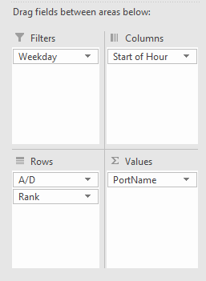

Pivot tables in excel are excellent at reorganising and summarising numerical data.  They're fast, intuitive and, iff you're a little creative, you can adapt them to solve a host of modelling problems.

However sometimes the required output is <b>text</b>. 

But you know that pivot tables <i> could </i> provide the right type of layout. 

I've seen some creative solutions to this problem, most involving using some from of index-match. The core problem is that pivots are made to <b> summarise numerical </b> data. But that doesn't stop us from trying. 

---

<h3>Text in a pivot: Bank Structure graph for Auckland Airport</h3>

 

You may look at the above and think, <b><i>'text in a pivot table, that's exactly what I want!'</i></b>. For the TLDR skip to step 5. 

---

In aviation, a <b><i>'bank structure'</i></b> is a common graphic for an airport. The graphic is read as:
<ul>
    <li><b>X-axis: </b>Time bands through the day (an hour in this case)</li>
    <li><b>Y-axis (top): </b>Flights arriving into the port</li>
    <li><b>X-axis: </b>Flights departing the port</li>
    <li><b>Label: </b>The arrival/departing port.</li>
</ul>

<i> i.e. a SYD flight above the line is an ariving Sydney-Auckland flight and below is a departing Auckland-Sydney flight </i>

Rather than type this out, a pivot table with a text output saves <b>a lot</b> of time

The top graphic is reference to the pivot table below it (plus a slicer and some condititional formatting based on region).
The question is how get the pivot table to show text.

---
<h3>Step 1: Get some data</h3>

 

Here I have some simple schedule data.
I've added it to Excel in a table 

    

    
 
        
 From here we can select our whole table and add it to the query. 
          
        <i> Data > From Table/Range </i> 
        

    

 

---

<h3>Step 2: Set up some extra columns</h3>

 

First we need to change the type of some to the columns from number to text. 
Let's change <u>'flight number'</u> and <u>'weekday'</u> to number. Make sure to 'replace' the step, rather than add a new one. 

Next we're going to add a few more columns.

 

<table class = "CodeTable">
    <colgroup>
       <col span="1" style="width: 30%;">
       <col span="1" style="width: 70%;">
    </colgroup>
    <tr>
        <td class= "CTL"><b>Start of Hour:</b></td>
        <td class= "CTR">Time.StartOfHour([Time])</td>
    </tr>
    <tr>
        <td class= "CTL"><b>ID:</b></td>
        <td class= "CTR">Number.ToText(Time.Hour([Time])) & [Port]  & [Operating Airline]  & [Flight No]</td>
    </tr>
    <tr>
        <td class= "CTL"><b>ID2:</b></td>
        <td class= "CTR">Number.ToText(Time.Hour([Time])) & [#"A/D"] &[Weekday]</td>
    </tr>
</table>

---

<h3>Step 3: Add to data model</h3>

 
    Now you can load the data, making sure to add this data to the Data Model.
    Then head to Manage Data Model.

    

    

---

<h3>Step 4: Add a rank to determine position</h3>

    

    
 
        

        
        =   VAR x = [ID2]  
            return  
            RANKX(FILTER(data, Data[ID2] = x   ),[ID]) * if(Data[A/D] = "A", -1, 1)
        

        

        This works by ranking our ID field on each line. (Based simply on alphabetical order in this case).
        It's ranked against only lines that match our filter.  From data the fields must have the same ID2 (same hour, same direction).
        

    

---

<h3>Step 5: CONCATENATEX</h3>

    

    
 
        

        And here's the step you were probably looking for. 
        If you add a new measure, either by clicking in a cell at the bottom of the page (or this can be reached outside the data manage page by viewing the pivot and right clicking > add measure)
        

        

        
        PortName:=CONCATENATEX(Data,Data[Port], ",")
        

        

        This concatenates our text fields together with a ",". 
        Presuming you have correctly seperated all rows that need seperating, there should be one element per line and no commas. 
        

---
<h3>Step 6: Layout Pivot Table</h3>

    

    
 
        
 
        The pivot table can now be layed out with the new measure in the Values column.
        

    

 
<h4>Pivot table output</h4>

 

---
<h3>Step 7: Formatting</h3>

Here I've added a little conditional formatting

 

