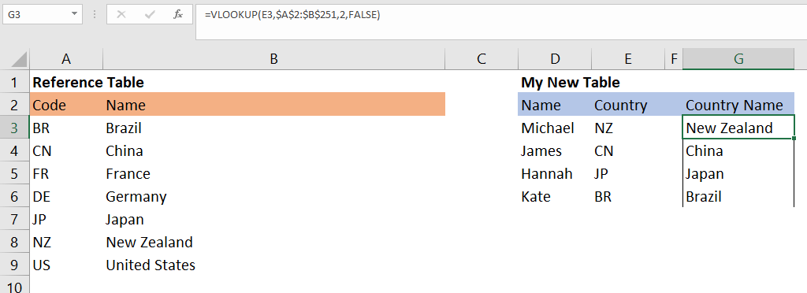
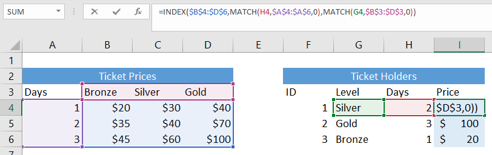
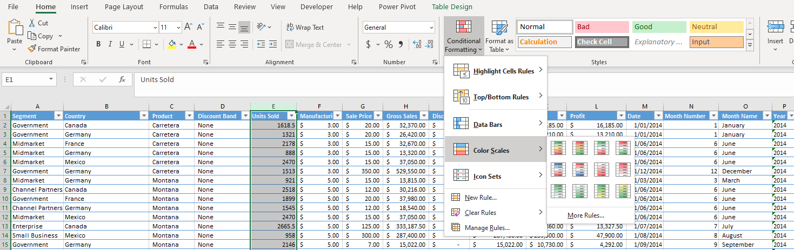
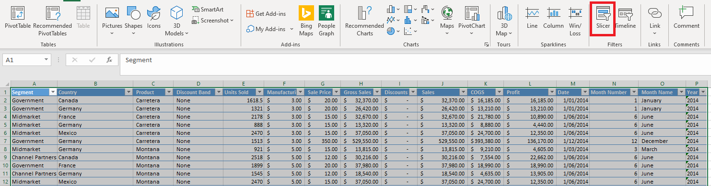
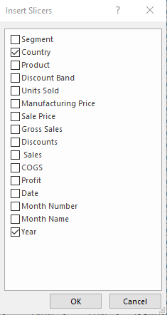
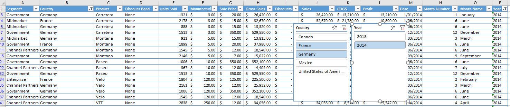

So you've oversold your way into a job and now it's time to deliver. You said you were a wizz in Excel but you just learnt to use the <b>if</b> function. Where do you go from here?

<h2>Basic formulas</h2>

First off, <i>(if you haven't already)</i> go learn the <b> basics.</b> I know it's boring to try to get a basic grasp on the most common formulas. Don't bother trying to memorise them all, you just need to know what's at your disposal.   There are a lot of cheet sheets online, find one that works for you. 

If you want a good explanation of each formula, I recommend <a href = "https://www.exceldemy.com/microsoft-excel-formulas-functions-cheat-sheet/">this one</a> 

If you want a quick overview, here's the one's I have found most useful.

    

        <table class = "CodeTable codeTableDouble">
            <colgroup>
            <col span="1" style="width: 20%;">
            <col span="1" style="width: 80%;">
            </colgroup>
            <tr>
                <td colspan="2" class = "TR1H TableTest">Text</td>
            </tr><tr class = "TR1">
                <td>LEFT/RIGHT</td>
                <td>Returns the specified number of characters from the start of a string</td>
            </tr><tr class = "TR1">
                <td>MID</td>
                <td>Return the characters from the middle of a string, given a starting position and length</td>
            </tr><tr class = "TR1">
                <td>LOWER/UPPER</td>
                <td>Converts all letters in a text string to lower/uppercase</td>
            </tr><tr class = "TR1">
                <td>PROPER</td>
                <td>Convers a string to proper case the first letter to uppercase and all other letters to lowercase</td>
            </tr><tr class = "TR1">
                <td>CLEAN</td>
                <td>Removes all non-printable characters from text</td>
            </tr><tr class = "TR1">
                <td>TRIM</td>
                <td>Remove sall spaces from a text string except for single spaces between words</td>
            </tr><tr class = "TR1">
                <td>LEN</td>
                <td>Returns the number of characters in a text string</td>
            </tr><tr class = "TR1">
                <td>FIND</td>
                <td>Returns the starting position of one text string within another text string</td>
            </tr><tr class = "TR1">
                <td>SEARCH</td>
                <td>Returns the number of the character at which a specific character or text string is found</td>
            </tr><tr class = "TR1">
                <td>SUBSTITUTE</td>
                <td>Replaces existing text with a new text in a text string</td>
            </tr><tr class = "TR1">
                <td>REPLACE</td>
                <td>Replaces part of a text string with a different text string</td>
            </tr><tr>
                <td class="TableTest TR2H" colspan="2";>Math</td>
            </tr><tr class = "TR2">
                <td>SUM</td>
                <td>Adds all the numbers in a range of cells</td>
            </tr><tr class = "TR2">
                <td>AVERAGE</td>
                <td>Averages all the numbers in a range of cells</td>
            </tr><tr class = "TR2">
                <td>MEDIAN</td>
                <td>The median all the numbers in a range of cells</td>
            </tr><tr class = "TR2">
                <td>COUNT</td>
                <td>Counts the number of cells in a range</td>
            </tr><tr class = "TR2">
                <td>COUNTA</td>
                <td>Counts the number of cells in a range that are not empty</td>
            </tr><tr class = "TR2">
                <td>SUMPRODUCT</td>
                <td>Returns the sum of the products corresponding ranges or arrays</td>
            </tr><tr class = "TR2">
                <td>MIN/MAX</td>
                <td>Returns the smallest/largest value in a data set</td>
            </tr><tr class = "TR2">
                <td>SMALL/LARGE</td>
                <td>Returns the kth smallest/largest value in a data set</td>
            </tr><tr class = "TR2">
                <td>MOD</td>
                <td>Returns the remainder after a number is divided by a divisor</td>
            </tr><tr class = "TR2">
                <td>SUBTOTAL</td>
                <td>Returns a subtotal - various options</td>
            </tr><tr class = "TR2">
                <td>VLOOKUP</td>
                <td></td>
            </tr><tr>
                <td colspan = "2" class = "TR3H TableTest">MISC</td>
            </tr><tr class = "TR3">
                <td>RANK.AVG/EK</td>
                <td>Looks for a value in the leftmost column/row, then returns a value in the same row/column from a column/row you specify</td>
            </tr><tr class = "TR3">
                <td>TRANSPOSE</td>
                <td>Converts a vertical range to a horizontal range and vice versa</td>
            </tr><tr class = "TR3">
                <td>VALUE</td>
                <td>Converts a text string that represents a number to a number</td>
            </tr>
        </table>
    

    

        <table class = "CodeTable codeTableDouble">
            <colgroup>
            <col span="1" style="width: 20%;">
            <col span="1" style="width: 80%;">
            </colgroup>
            <tr>
                <td colspan = "2" class = "TR4H TableTest">If Statements</td>
            </tr><tr class = "TR4">
                <td>IF</td>
                <td>Checks if the condition is met, then returns one value or another</td>
            </tr><tr class = "TR4">
                <td>AND, OR, NOT, XOR</td>
                <td>Make sure all or some of the conditions are true</td>
            </tr><tr class = "TR4">
                <td>ISERROR</td>
                <td>Returns TRUE if the cell results is an error</td>
            </tr><tr class = "TR4">
                <td>IFERROR</td>
                <td>Do something if the cell is an error</td>
            </tr><tr class = "TR4">
                <td>SUMIF, COUNTIF, AVERAGEIF</td>
                <td>SUM/COUNT/AVERAGE only the cells meeting the criteria</td>
            </tr><tr class = "TR4">
                <td>SUMIFS, COUNTIFS, AVERAGEIFS</td>
                <td>As above but with multiple criteria </td>
            </tr><tr>
                <td colspan="2" class = "TR5H TableTest" >Date</td>
            </tr><tr class = "TR5">
                <td>DATE</td>
                <td>Returns the number that represents a date</td>
            </tr><tr class = "TR5">
                <td>TIME</td>
                <td>Returns the number that represents a time</td>
            </tr><tr class = "TR5">
                <td>NOW</td>
                <td>Gets the time now</td>
            </tr><tr class = "TR5">
                <td>TODAY</td>
                <td>Get the date today</td>
            </tr><tr class = "TR5">
                <td>YEAR</td>
                <td>Pull the year from a date</td>
            </tr><tr class = "TR5">
                <td>MONTH</td>
                <td>Pull the month from a date</td>
            </tr><tr class = "TR5">
                <td>DAY</td>
                <td>Pull the day from a date</td>
            </tr><tr class = "TR5">
                <td>HOUR</td>
                <td>Pull the Hour from a time</td>
            </tr><tr class = "TR5">
                <td>MINUTE</td>
                <td>Pull the Minute from a time</td>
            </tr><tr class = "TR5">
                <td>SECOND</td>
                <td>Pull the Second from a time</td>
            </tr><tr class = "TR5">
                <td>WEEKDAY</td>
                <td>Get the day of week from a date</td>
            </tr><tr class = "TR5">
                <td>DAYS</td>
                <td>Get the number of days between tow dates</td>
            </tr><tr class = "TR5">
                <td>NETWORKDAYS</td>
                <td>Returns the number of whole workdays between two dates</td>
            </tr><tr class = "TR5">
                <td>WORKDAY</td>
                <td>Returns the date after a number of work days</td>
            </tr><tr>
                <td colspan="2" class = "TR6H TableTest">Reference</td>
            </tr><tr class = "TR6">
                <td>CHOOSE</td>
                <td>Choose a value or action to perform from a list of values, based on an index number</td>
            </tr><tr class = "TR6">
                <td>INDEX</td>
                <td>Return a cell in a range given the row and column</td>
            </tr><tr class = "TR6">
                <td>INDIRECT</td>
                <td>Returns the reference specified by a text string</td>
            </tr><tr class = "TR6">
                <td>OFFSET</td>
                <td>Return the cell a number of rows and columns away from another cell</td>
            </tr><tr class = "TR6">
                <td>ROW,COL</td>
                <td>Return the row or column of a cell</td>
            </tr>
        </table>
    

 

---
<h2>Basic Skills</h2>

 There's a lot you can learn through practice and googling but there few techniques that are less intutive but very useful. 

<h3>Vlookup</h3>

Vlookup is one of the msot common and most handy Excel formulas and is often quite hard for new users to wrap their head around. 

 Imagine you've been given a table that has references to other data.
In this case, imagine you have the country code for each person but not the name of country. Luckily, in another 'reference' table, you have the name associated with each country.  Vlookup saves you finding and copying each line of data!

 

 The formula has <b>four</b> arguments:

=VLOOKUP(lookup_value, table_array,col_index_number, [range_lookup]) 

<table class = "CodeTable">
    <colgroup>
       <col span="1" style="width: 30%;">
       <col span="1" style="width: 70%;">
    </colgroup>
    <tr>
        <td class= "CTL"><b>lookup_value:</td>
        <td class= "CTR">Our reference value, in this case E3 (our Country Code)</td>
    </tr>
    <tr>
        <td class= "CTL"><b>table_array</td>
        <td class= "CTR">Our reference table. Note: You can lock the reference so it doesn't move when copied to other cells buy adding a $ in front of the letter to lock the column, and in front of the number of lock the row.</td>
    </tr>
    <tr>
        <td class= "CTL"><b>col_index_number</td>
        <td class= "CTR">Vlookup will search to find the first matching row. I.e, as we're looking for "NZ", it will find the 7th row (A8). We need to tell vlookup to get the data from column 2.</td>
    </tr>
        <tr>
        <td class= "CTL"><b>[range_lookup]</td>
        <td class= "CTR">This will default to TRUE (which will normally be the wrong choice). 
        If TRUE, vlookup will find the closest match. I.e. NY is a close match to NZ, so we might get the wrong answer. FALSE means find me the EXACT match, which is normally what we want. 
        </td>
    </tr>
</table>

<h3>Index Match</h3>

Index Match is VLOOKUP on steriods. 

Index match is use of Index and match formulas together that is used to overcome the limitaions of VLOOKUP.  

The INDEX formula takes an range as an input, then returns the cell on the requested ROW and COLUMN.  We then use MATCH to work out which ROW and COLUMN we want to return. 

MATCH takes a value to search for, in a range and then does either a perfect match (0) or an approximate match (1). In this case, we are looking for Silver (G4) in the area B3:D3 which will return '2' letting index know to return the second column. 

<h3>Conditional formatting</h3>

Conditional formatting is great for exploring data and formatting reports.  The easiest to sue is the simple colour scales. For more complex formatting, making custom rules is possible.

<h3>Slicers</h3>

    

    
 
        
 From here we can select our whole table and add it to the query. 
          
        <i> Data > From Table/Range </i> 
        

    

 

Here's the final result

---

<h3>Learn the shortcuts</h3>

Excel has hundreds of shortcuts help you go faster. At first it can seem pointles, why try and remember a shortcut when you know how to do it with the mouse? Excel without without shortcuts is like typing with a mouse.  Once you know them on instinct, you will work much faster. Learning the key ones is highly advised.  Everyone has different needs and therefore uses different shortcuts.  These are some of the basics. If you find yourself doing something repetitive with mouse, there's a probably a shortcut for it. 

    

        <table class = "CodeTable codeTableDouble">
            <colgroup>
            <col span="1" style="width: 40%;">
            <col span="1" style="width: 60%;">
            </colgroup>
            <tr>
                <td colspan="2" class = "TR1H TableTest">Moving</td>
            </tr><tr class = "TR1">
                <td>Ctrl + Left/Right</td>
                <td>Move to the farthest cell left or right in the row</td>
            </tr><tr class = "TR1">
                <td>Tab</td>
                <td>Next cell</td>
            </tr><tr class = "TR1">
                <td>Shift + Tab</td>
                <td>Previous Cell</td>
            </tr><tr class = "TR1">
                <td>Ctr l+ End</td>
                <td>Bottom right used cell</td>
            </tr><tr class = "TR1">
                <td>Home</td>
                <td>Left cell in the current row</td>
            </tr><tr class = "TR1">
                <td>Ctr l+ Home</td>
                <td>Move to the beginning of a worksheet</td>
            </tr><tr class = "TR1">
                <td>Page Up/Down</td>
                <td>Move one screen up or down in a worksheet</td>
            </tr><tr class = "TR1">
                <td>Alt + Page Up/Down</td>
                <td>Speed move up and down</td>
            </tr><tr class = "TR1">
                <td>Ctrl + Page Up/Down</td>
                <td>Next/Previous work sheet</td>
            </tr><tr>
                <td class="TableTest TR2H" colspan="2";>File</td>
            </tr><tr class = "TR2">
                <td Ctrl + N></td>
                <td New Workbook></td>
            </tr><tr class = "TR2">
                <td>Ctrl + O</td>
                <td>Open Workbook</td>
            </tr><tr class = "TR2">
                <td>Ctrl + S</td>
                <td>Save</td>
            </tr><tr class = "TR2">
                <td>Ctrl + W</td>
                <td>Close Workbook</td>
            </tr><tr class = "TR2">
                <td>Ctrl + Z/Y</td>
                <td>Undo/Redo</td>
            </tr><tr class = "TR2">
                <td>F9</td>
                <td>Force calculate in all workbooks</td>
            </tr><tr class = "TR2">
                <td>Ctrl + Tab</td>
                <td>Switch workbooks</td>
            </tr>
        </table>
    

    

        <table class = "CodeTable codeTableDouble">
            <colgroup>
            <col span="1" style="width: 40%;">
            <col span="1" style="width: 60%;">
            </colgroup>
            <tr>
                <td class = "TR3H TableTest" colspan="2">Format</td>
            </tr><tr class = "TR3">
                <td>Ctrl+ B</td>
                <td>Bold</td>
            </tr><tr class = "TR3">
                <td>Ctrl + I</td>
                <td>Italic</td>
            </tr><tr class = "TR3">
                <td>Ctrl + U</td>
                <td>Underline</td>
            </tr><tr class = "TR3">
                <td>Ctrl + Shift + $</td>
                <td>Currency format</td>
            </tr><tr class = "TR3">
                <td>Ctrl + Shift + %</td>
                <td>Percent format</td>
            </tr><tr>
                <td class = "TR4H TableTest" colspan="2">Select</td>
            </tr><tr class = "TR4">
                <td>Shift + Left/Right</td>
                <td>Extend the cell selection to the left or right</td>
            </tr><tr class = "TR4">
                <td>Shift + Space</td>
                <td>Select the entire row</td>
            </tr><tr class = "TR4">
                <td>Ctrl + Space</td>
                <td>Select the entire column</td>
            </tr><tr class = "TR4">
                <td>Ctrl+ Shift + Space</td>
                <td>Select the entire worksheet</td>
            </tr><tr>
                <td class = "TR5H TableTest" colspan="2">Edit</td>
            </tr><tr class = "TR5">
                <td>Ctrl+ X</td>
                <td>Cut</td>
            </tr><tr class = "TR5">
                <td>Ctrl + C </td>
                <td>Copy</td>
            </tr><tr class = "TR5">
                <td>Ctrl + V</td>
                <td>Paste</td>
            </tr><tr class = "TR5">
                <td>Alt + Enter</td>
                <td>Return inside a cell</td>
            </tr><tr class = "TR5">
                <td>Ctrl + Alt + V</td>
                <td>Open the Paste Special dialog box</td>
            </tr><tr class = "TR5">
                <td>ALT + * + *</td>
                <td>Choose from the ribbon</td>
            </tr>
        </table>
    

 

---

These are the basics I wish I had been taught on day one of my first job.  I've tried to pass these on to those around me. Excel has a lot to it and this is only the begining.  
