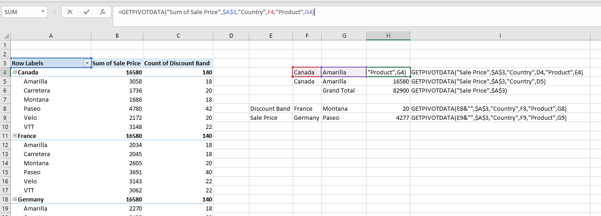
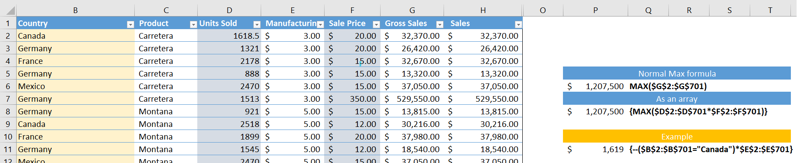
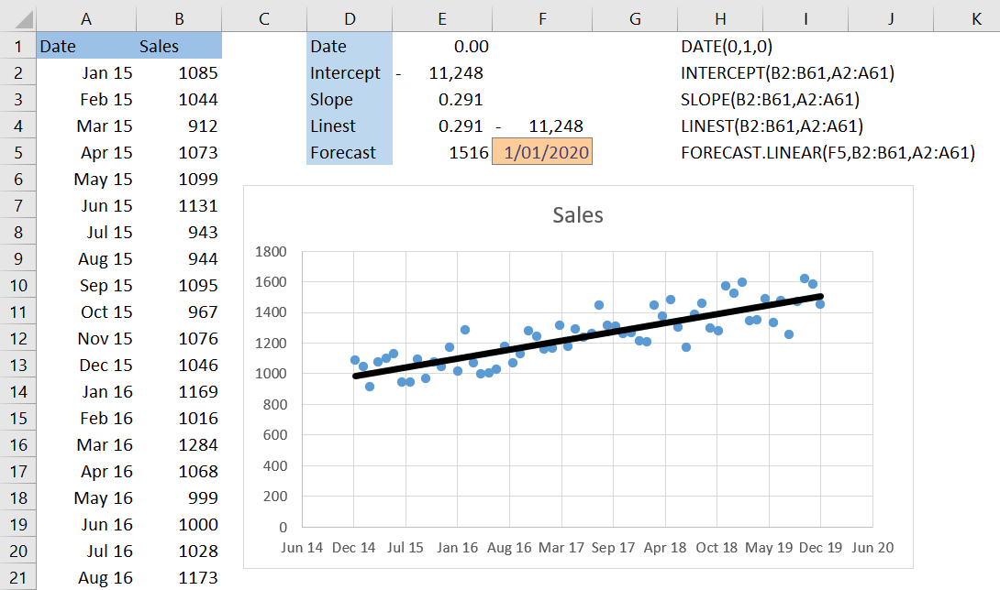
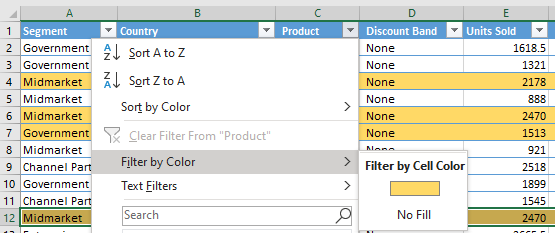

 I discover new techniques in Excelall the time.  There's still a litany of shorcuts I keep thinking I should memorise. 

 I've noticed even long-time Excel users don't pick up everything.  Here's my quick list of (useful) things you might have missed! 

---
<h2>1) Pivot table formulas</h2>

I learn hard on this technique but for some reason, no-one else seems to use it. 

Most people will intutively know you can set a cell to equal a cell in a pivot. Doing so generates a formula that puts people off. These formulas are so useful. Any info in the pivot can be referenced directly without a cell reference. 

=GETPIVOTDATA("Sum of Sale Price",$A$3,"Country",F4,"Product",G4)
<ul>
    <li>The $A$3 references the pivot</li>
    <li>Changing "Country" to F4 will allow you to pull the Sum for different countries</li>
    <li>Removing the "Product, G4 section allows you to get the subtotal</li>
    <li>Removing the Country and the Sale Price gets you the grand total</li>
    <li>Changing the metric "Sum of Sale Price" to E9&"" allows the metric to be flexible</li>
</ul>

Knowing this you can have reference tables with metrics and that update when your data is refreshed. 

---

<h2>2) Array formulas</h2>

Unless you came from a programming background, this one can take some time to get your head around. It might take some playing around in Excel before this one finally clicks. 

Say we want to get the maxium Gross Sales.  We could use the MAX function on the Gross Sales Column. But what if we don't have the column?  Can we calculate the results without making the column? We sure can!

We can take the maximum of: (Unit Column * Sales Price Column).  But if we just hit enter, we will get an error. Instead we hit Ctrl + Shift + Enter

Excel will take the two ranges and multiply each number togther seperately. Then, with this in mind, will take the maximum of that and return the right answer

Using this you can strip out a long of extra calculation and once you're aware of it, you WILL find use cases

 I've often found myself using an array with a --. For example, if we do -- on range == "Canada", Excel will return a series of TRUE/FALSE values. -- converts these to 1 (TRUE) or 0 (FALSE) =. We can then multiply by a column and Excel will multiply each number by 0 or 1 if TRUE or FALSE. Excel will then return the SUM for all matching values when Canada was TRUE. In this case the result should be the same as a SUMIF formula.

---

<h2>3) Slope, Intercept, Linest, Forecast</h2>

These are really easy to use and make you look like a wizz.

Say you want to predict sales for next year. You can first plot the data like below. You can right click to 
The most common and easiest prediction is a linear estimate. If you plot your data like below, you can add right click your data point and a regression line.

<table class = "CodeTable">
    <colgroup>
       <col span="1" style="width: 30%;">
       <col span="1" style="width: 70%;">
    </colgroup>
    <tr>
        <td class= "CTL"><b>Intercept</b></td>
        <td class= "CTR">Where on the Y-axis the regession line would cross when the X-axis is 0 (Remembering that in Excel a date of 0 is 01/01/1900)</td>
    </tr>
    <tr>
        <td class= "CTL"><b>Slope</b></td>
        <td class= "CTR">How much the trend increases or decreases each day. (A day is 1 in Excel)</td>
    </tr>
    <tr>
        <td class= "CTL"><b>Linest</b></td>
        <td class= "CTR">An array formula that returns both of the above!</td>
    </tr>
    <tr>
        <td class= "CTL"><b> </b></td>
        <td class= "CTR">Combining these we can make a forecast.  On 1/1/2020 (date = 43831), we can predict -11248 + 43831 * 0.291 = 1,516</td>
    </tr>
    <tr>
        <td class= "CTL"><b>Forecast</b></td>
        <td class= "CTR">There are range of forecast formulas which can do this for you. FORECAST.LINEAR predicts in the way as above, but there are others that predict with different methods.</td>
    </tr>

</table>

---

<h2>4) Filter by color</h2>

    

    
 
        
 Some people may think this is obvious but it took me years to realise I could filter by colour. 

    

---

<h2>5) Custom Formatting</h2>

 You can create some very useful custom formats if you can wrap your head around the syntax. The syntax for this could easily fill a long blog post but others have already done a much better job than me. For now, know that you can do such things as:

<table class = "CodeTable">
    <colgroup>
       <col span="1" style="width: 40%;">
       <col span="1" style="width: 60%;">
    </colgroup>
    <tr>
        <td class= "CTL">Round the nearest thousand:</td>
        <td class= "CTR"> #,##0,  13,234  --> 13</td>
    </tr>
        <tr>
        <td class= "CTL">Add text to this</td>
        <td class= "CTR"> #,##0,k  13,234  --> 13k</td>
    </tr>
    <tr>
        <td class= "CTL">Format text</td>
        <td class= "CTR"> "Mr. " @  Smith  --> Mr. Smith</td>
    </tr>
        <tr>
        <td class= "CTL">Add colours and change decimal places</td>
        <td class= "CTR"> [Blue][>10]#,###;[Green][>1]#.#;  
         
        1126.27  --> 1,126
         
        1.235    --> 1.2
        </td>
    </tr>
</table>
